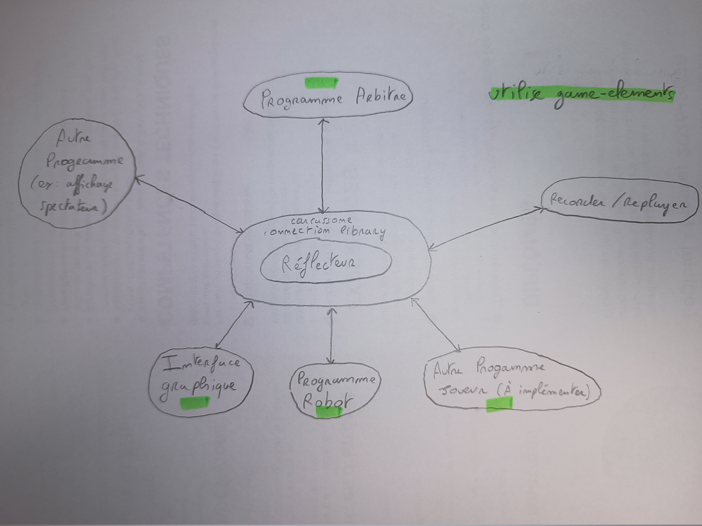

# Guide du Participant — Tournoi Carcassonne

Bienvenue dans le tournoi Carcassonne ! Ce document explique tout ce que vous devez savoir pour participer : architecture du projet, règles du tournoi, modes de participation, et instructions de lancement.

---

## Table des matières

- [Vue d'ensemble du projet](#vue-densemble-du-projet)
- [Les programmes disponibles](#les-programmes-disponibles)
- [Protocole de communication](#protocole-de-communication)
- [Déroulement d'une partie](#déroulement-dune-partie)
- [Modes de participation](#modes-de-participation)
- [Lancement](#lancement)
- [Utilisation des librairie](#utilisation-des-librairies)
- [Règles du jeu](#règles-du-jeu)
- [Créer son propre robot](#créer-son-propre-robot)
- [Créer sa propre interface](#créer-sa-propre-interface)
- [Outils utilitaires](#outils-utilitaires)
- [Ressources et références](#ressources-et-références)

---

## Vue d'ensemble du projet

Le projet Carcassonne est composé de plusieurs programmes indépendants qui communiquent entre eux via un **réflecteur centralisé** en WebSocket. Le réflecteur agit comme un hub : il reçoit les messages d'un programme et les redistribue à tous les autres connectés.



Chaque programme se voit attribuer un **rôle** (`referee`, `player`, `spectator`, `utility`) qui détermine ce qu'il peut envoyer et recevoir. Ces rôles sont attribués par l'arbitre via le message `ELECTS`.

---

## Les programmes disponibles

### 1. La librairie de connexion — `carcassonne_connection_library`

> Voir README [carcassonne_connection_library](https://gitlab-etu.fil.univ-lille.fr/l3s6-projet-g6-star/carcassonne_connection_library)

Librairie Java partagée par tous les programmes pour communiquer avec le réflecteur. Elle gère la connexion WebSocket, le formatage des messages et la validation des arguments. **Tous les programmes participants doivent l'utiliser** pour garantir la cohérence du protocole.

Elle expose trois niveaux de rôles sous forme d'une hiérarchie de classes :

| Rôle | Classe | Capacités |
|---|---|---|
| **Spectateur** | `SpectatorView` | Reçoit toutes les mises à jour, ne peut rien envoyer |
| **Joueur** | `PlayerView` | + peut envoyer `PLAYS`, `PLACES`, `AGREES`, `LEAVES` |
| **Arbitre** | `AdminView` | + peut envoyer `STARTS`, `ENDS`, `OFFERS`, `ELECTS`, `GRANTS`, `EXPELS`, `SCORES`, `BLAMES`, `COLLECTS`, `CLOSE` |

### 2. La librairie de jeu — `game-elements`

> Voir README [game-elements](https://gitlab-etu.fil.univ-lille.fr/l3s6-projet-g6-star/game-elements)

Librairie Java contenant toutes les structures de données du jeu Carcassonne : tuiles, bords, zones, plateau, joueurs, meeples. Indispensable pour tout programme qui doit modéliser l'état du jeu (robot, interface graphique, arbitre).

Exemples d'objets disponibles : `Tile`, `Board`, `Coordinates`, `Player`, `Meeple`, `Edge`, `Zone`, `Topology`, `Direction`, `Orientation`.

### 3. Le programme arbitre — `programme_arbitre`

> Voir README [programme_arbitre](https://gitlab-etu.fil.univ-lille.fr/l3s6-projet-g6-star/programme_arbitre)

Programme arbitre orchestrant une partie de Carcassonne en réseau. Il est responsable du déroulement de la partie, offre des tuiles aux joueurs et valide les coups ou blame les joueurs.

### 4. L'interface graphique — `SwingPlayerGUI`

> Voir README [SwingPlayerGUI](https://gitlab-etu.fil.univ-lille.fr/l3s6-projet-g6-star/swingplayergui)

Interface Java Swing permettant à un humain de jouer à Carcassonne. Elle se connecte au réflecteur, affiche l'état du plateau et permet au joueur humain de placer ses tuiles et meeples via une interface visuelle.

### 5. Le programme robot — `programme_robot`

> Voir README [programme_robot](https://gitlab-etu.fil.univ-lille.fr/l3s6-projet-g6-star/programme_robot)

Programme Python (utilisant JPype pour interagir avec les librairies Java) qui joue automatiquement à Carcassonne. Il reçoit les tuiles proposées par l'arbitre et décide de leur placement selon une stratégie configurable. La stratégie par défaut (`RandomMoveStrategy`) choisit un coup aléatoire parmi les coups valides.

### 6. Recorder & Replayer

> Voir README [recorder_replayer](https://gitlab-etu.fil.univ-lille.fr/l3s6-projet-g6-star/recorder_replayer)

Outils Node.js et Python permettant d'enregistrer tous les messages d'une partie dans un fichier, puis de les rejouer. Utiles pour analyser des parties, déboguer ou rejouer des scénarios de test.

---

## Protocole de communication

> Voir le document : [messages_carcassonne.md](./messages_carcassonne.md)

Tous les messages transitent par le réflecteur sous forme de chaînes de texte. La librairie `carcassonne_connection_library` gère automatiquement leur construction et leur validation, mais il est utile de comprendre le protocole.

---

## Déroulement d'une partie

### Séquence de lancement

Voici l'ordre dans lequel les programmes doivent être lancés :

```
1. Lancer le réflecteur (WebSocket hub)
        ↓
2. Connecter le programme arbitre au réflecteur
        ↓
3. Connecter les joueurs (robots ou interfaces humaines)
   → Chaque joueur envoie le message PLAYS pour indiquer sa présence
        ↓
4. L'arbitre attribue les rôles (ELECTS) et démarre la partie (STARTS)
        ↓
5. L'arbitre distribue les meeples initiaux (COLLECTS) et propose la première tuile (OFFERS)
        ↓
6. La partie se déroule tour par tour jusqu'au message ENDS
```

### Séquence d'un tour

```
Arbitre → arbitreId OFFERS joueurId tile         (propose une tuile au joueur dont c'est le tour)
Joueur  → joueurId PLACES joueurId orientation x y   (le joueur place la tuile)

Arbitre → arbitreId PLACES joueurId orientation x y   (l'arbitre confirme le placement)
         ou
Arbitre → arbitreId BLAMES joueurId reason        (coup invalide)

Arbitre → arbitreId SCORES joueurId points        (si des points sont marqués)
Arbitre → arbitreId COLLECTS joueurId type x y   (si des meeples sont récupérés)
```

---

## Modes de participation

Il existe plusieurs façons de participer au tournoi selon votre niveau et vos envies.

### Mode 1 — Jouer en tant que joueur humain (interface graphique)

Vous utilisez l'interface graphique `SwingPlayerGUI` fournie pour jouer contre d'autres humains ou contre des robots. Aucun code à écrire.

**Convient pour :** les parties humain vs humain, humain vs robot.

### Mode 2 — Utiliser le robot avec une stratégie personnalisée

Vous repartez du programme robot existant et implémentez votre propre stratégie en Python en sous-classant `MoveStrategy`. C'est l'option la plus accessible pour créer un robot compétitif sans repartir de zéro.

**Convient pour :** les parties robot vs robot, robot vs humain. Idéal pour les participants souhaitant se concentrer sur l'IA sans gérer la communication réseau.

Trois méthodes sont à implémenter dans votre stratégie :
- `should_place_meeple()` → renvoie `True` si un meeple doit être placé
- `get_tile_placement()` → renvoie les coordonnées et l'orientation de placement
- `get_meeple_placement()` → renvoie la position complète du meeple

### Mode 3 — Créer son propre programme robot (Java ou autre)

Vous créez un programme robot from scratch en héritant de `PlayerView` (librairie `carcassonne_connection_library`). Vous avez ainsi un contrôle total sur la logique de jeu.

**Convient pour :** les participants expérimentés souhaitant une architecture sur mesure.

### Mode 4 — Créer sa propre interface graphique

Vous développez votre propre interface visuelle en héritant de `PlayerView` et en utilisant la librairie `game_elements` pour modéliser l'état du jeu.

**Convient pour :** les participants intéressés par le développement d'interfaces utilisateur.

---

## Lancement

### Script de build

Un script est mis à votre disposition pour faciliter l'installation des différents dépots du projet.

Pour lancer le script :
Sur Windows : `./build.ps1`
Sur Linux : `./build.sh` (il faut d'abord donner les droits d'exécution au script par la commande `chmod -x ./build.sh`)

Pour lancer l'exécutable que vous souhaitez, placez vous dans le dossier `build` et lancez la commande `java -jar` correspondante (référez vous aux Readme du dépot concerné pour obtenir la commande exacte)

### Lancer une partie

Tout d'abord vous devez télécharger un réflecteur : [Linux-x64](https://gitlab.univ-lille.fr/fil-l3-projet/portail/-/raw/public/reflector-linux-x64.tgz), [Linux-arm64](https://gitlab.univ-lille.fr/fil-l3-projet/portail/-/raw/public/reflector-linux-arm64.tgz), [Mac-arm64](https://gitlab.univ-lille.fr/fil-l3-projet/portail/-/raw/public/reflector-macos-arm64.tgz), [Mac-x64](https://gitlab.univ-lille.fr/fil-l3-projet/portail/-/raw/public/reflector-macos-x64.tgz), [Windows-x64](https://gitlab.univ-lille.fr/fil-l3-projet/portail/-/raw/public/reflector-windows-x64.tgz).

1) Lancer le réflecteur :  
sur Windows `.\reflector.exe --host 127.0.0.1 --port 3000`  
sur Linux `./reflector --help`  

2) Connecter un programme arbitre au réflecteur :  
- Se placer dans `participant_info/build`  
- `java -jar .\RefereeView.jar 127.0.0.1 3000 <arbitreID> <nbPlayers>`

3) Connecter les joueurs :    
- Soit une interface graphique :  
    - Se placer dans `participant_info/build`  
    - `java -jar .\PlayerController.jar 127.0.0.1 3000 <playerId>`  
- Soit un programme robot :  
    - voir [programme_robot](https://gitlab-etu.fil.univ-lille.fr/l3s6-projet-g6-star/programme_robot)

Une fois le bon nombre de joueurs connectés la partie se lancera.

---

## Utilisation des librairies

### Étape 1 — Installer les librairies

```bash
# Installer la librairie de connexion
git clone git@gitlab-etu.fil.univ-lille.fr:l3s6-projet-g6-star/carcassonne_connection_library.git
cd carcassonne_connection_library
mvn clean install

# Installer la librairie de jeu
git clone git@gitlab-etu.fil.univ-lille.fr:l3s6-projet-g6-star/game-elements.git
cd game_elements
mvn clean install
```

### Étape 2 — Ajouter les dépendances à votre projet Maven

```xml
<dependency>
    <groupId>l3s6.projet.star</groupId>
    <artifactId>carcassonne_connection_library</artifactId>
    <version>1.0-SNAPSHOT</version>
</dependency>
```

Pour plus d'informations : voir les README de [carcassonne_connection_library](https://gitlab-etu.fil.univ-lille.fr/l3s6-projet-g6-star/carcassonne_connection_library) et [game-elements](https://gitlab-etu.fil.univ-lille.fr/l3s6-projet-g6-star/game-elements).

---


## Règles du jeu

Carcassonne est un jeu de placement de tuiles dans lequel les joueurs construisent un paysage médiéval (villes, routes, champs, abbayes) et y placent des meeples pour marquer des points.

### Tour de jeu

1. L'arbitre propose une tuile au joueur (`OFFERS`).
2. Le joueur choisit où placer la tuile sur le plateau et dans quelle orientation (`PLACES`).
3. Le joueur peut placer un meeple sur l'une des zones de la tuile posée (optionnel).
4. L'arbitre valide le placement et attribue les points éventuels (`SCORES`).
5. Si une structure est complétée, les meeples y participant sont récupérés (`COLLECTS`).

### Contraintes de placement

- Une tuile doit être placée adjacent à une tuile déjà posée.
- Les bords en contact doivent être compatibles (même topologie).
- Un meeple peut être placé sur une route, une ville ou une abbeye.
- Un meeple ne peut être placé que sur une zone libre (non déjà occupée sur la structure complète).
- Les meeples ne peuvent pas être placés sur des zones de type `FIELD` (champ). Ce placement de meeple ainsi que les extentions du jeu pourront être ajouté dans l'avenir.

### Scoring

- **Ville** incomplète en fin de partie : 1 point par tuile + 1 point par bouclier.
- **Ville** complète : 2 points par tuile + 2 points par bouclier.
- **Route** incomplète en fin de partie : 1 point par tuile.
- **Route** complète : 1 point par tuile.
- **Abbaye** avec 8 tuiles adjacentes (complète) : 9 points.
- **Abbaye** incomplète en fin de partie : 1 point + 1 point par tuile adjacente.

### Blâmes et expulsion

Un joueur accumulant trop de blâmes (nombre défini par l'arbitre via `BLAMES amount`) est expulsé de la partie.

Pour en savoir plus: voir README [programme_arbitre](https://gitlab-etu.fil.univ-lille.fr/l3s6-projet-g6-star/programme_arbitre)

### Fin de partie

L'arbitre envoie `ENDS` en indiquant l'identifiant du (ou des) joueur(s) gagnant(s). En cas d'égalité, plusieurs identifiants sont listés.

---

## Créer son propre robot

> Voir README [programme_robot](https://gitlab-etu.fil.univ-lille.fr/l3s6-projet-g6-star/programme_robot)

### Option A — Nouvelle stratégie Python (recommandée)

Créez une sous-classe de `MoveStrategy` et implémentez les trois méthodes :

```python
class MaStrategie(MoveStrategy):

    def should_place_meeple(self, tile, board) -> bool:
        # Retourne True si un meeple doit être placé
        return True

    def get_tile_placement(self, tile, board):
        # Retourne (coordonnées, orientation)
        # Utilisez board.getOutsideFrontierTiles() pour les positions disponibles
        # Utilisez tile.isCompatible(other, direction) pour vérifier la validité
        ...

    def get_meeple_placement(self, tile, board):
        # Retourne (coordonnées, orientation, direction, index)
        ...
```

Puis assignez votre stratégie dans `GameManager` :

```python
self.move_strategy = MaStrategie()
```

### Option B — Robot Java from scratch

Créez une classe héritant de `PlayerView` issu de [carcassonne_connection_library](https://gitlab-etu.fil.univ-lille.fr/l3s6-projet-g6-star/carcassonne_connection_library) :

```java
public class MonRobot extends PlayerView<PlayerClient> {

    public MonRobot(String ip, int port, String id) throws Exception {
        super(ip, port, id);
    }

    @Override
    public void updateOnOffer(String sourceId, String targetPlayer, String tile) {
        if (targetPlayer.equals(this.id) && this.roleManager.isRole(sourceId, Role.REFEREE)) {
            // Logique de décision
            this.send("PLACES", this.id, "N", 0, 0);
        }
    }

    @Override
    public void updateOnScore(String sourceId, String targetPlayer, int score) {
        System.out.println(targetPlayer + " marque " + score + " points.");
    }
}
```

### Utiliser `game_elements` pour modéliser le plateau

La librairie [game-elements](https://gitlab-etu.fil.univ-lille.fr/l3s6-projet-g6-star/game-elements) vous donne accès à toutes les structures du jeu :

```java
// Construire une tuile depuis sa représentation textuelle
TileBuilder builder = new TileBuilder();
Tile tile = builder.build("Nc3-f1r4f2-f2-f2r4f1");

// Vérifier si une tuile est placeable
tile.isCompatible(otherTile, Direction.RIGHT);

// Accéder aux zones d'un bord
Zone zone = tile.getZoneAt(Direction.TOP, 0);

// Gérer le plateau
Board board = new Board(startingTile);
board.putTileAt(tile, new Coordinates(1, 0));
board.getOutsideFrontierTiles(); // positions disponibles
```

---

## Créer sa propre interface

Héritez de `PlayerView` issu de [carcassonne_connection_library](https://gitlab-etu.fil.univ-lille.fr/l3s6-projet-g6-star/carcassonne_connection_library) et surchargez les méthodes `updateOn...` pour réagir aux événements de jeu :

| Méthode | Déclenchée quand... |
|---|---|
| `updateOnOffer(sourceId, targetPlayer, tile)` | Une tuile est proposée |
| `updateOnPlace(id, id', orientation, x, y)` | Une tuile est placée |
| `updateOnPlaceWithMeeple(id, id', orientation, x, y, type, pos)` | Une tuile avec meeple est placée |
| `updateOnScore(sourceId, targetPlayer, score)` | Un score est attribué |
| `updateOnBlameWithReason(sourceId, targetPlayer, reason)` | Un blâme est reçu |

Pour vérifier le rôle d'un autre participant (par exemple, s'assurer que le message vient bien de l'arbitre) :

```java
boolean isReferee = this.getRoleManager().isRole(sourceId, Role.REFEREE);
```

---

## Outils utilitaires

### Enregistrer et rejouer une partie

> Voir README [recorder_replayer](https://gitlab-etu.fil.univ-lille.fr/l3s6-projet-g6-star/recorder_replayer)

```bash
# Enregistrer une partie
node recorder.js <addr> <port> <fichier.txt>
python recorder.py <addr> <port> <fichier.txt>

# Rejouer une partie enregistrée
node replayer.js <addr> <port> <fichier.txt>
python replayer.py <addr> <port> <fichier.txt>
```

Ces outils sont utiles pour :
- **Déboguer** votre robot en rejouant les mêmes séquences
- **Analyser** des parties après coup
- **Tester** la robustesse de votre programme face à des scénarios spécifiques

---

## Ressources et références

| Ressource | Description |
|---|---|
| [carcassonne_connection_library](https://gitlab-etu.fil.univ-lille.fr/l3s6-projet-g6-star/carcassonne_connection_library) | Librairie de connexion WebSocket, rôles, envoi/réception de messages |
| [game-elements](https://gitlab-etu.fil.univ-lille.fr/l3s6-projet-g6-star/game-elements) | Structures de données du jeu (tuiles, plateau, zones, meeples) |
| [programme_arbitre](https://gitlab-etu.fil.univ-lille.fr/l3s6-projet-g6-star/programme_arbitre) |Programme arbitre orchestrant une partie de Carcassonne en réseau |
| [messages_carcassonne.md](./messages_carcassonne.md) | Protocole complet de communication (format de tous les messages) |
| [programme_robot](https://gitlab-etu.fil.univ-lille.fr/l3s6-projet-g6-star/programme_robot) | Programme robot Python, architecture MoveStrategy |
| [SwingPlayerGUI](https://gitlab-etu.fil.univ-lille.fr/l3s6-projet-g6-star/swingplayergui) | Interface graphique pour joueurs humains |
| [recorder_replayer](https://gitlab-etu.fil.univ-lille.fr/l3s6-projet-g6-star/recorder_replayer) | Outils d'enregistrement et de replay de parties |

---

## Résumé rapide — Par où commencer ?

| Je veux… | Par où commencer |
|---|---|
| Jouer en humain | Lancer `SwingPlayerGUI` |
| Créer un robot simplement | Sous-classer `MoveStrategy` dans le projet robot Python |
| Créer un robot avancé en Java | Hériter de `PlayerView` (carcassonne_connection_library) |
| Construire ma propre interface | Hériter de `PlayerView` + utiliser `game_elements` |
| Analyser des parties | Utiliser recorder/replayer |

